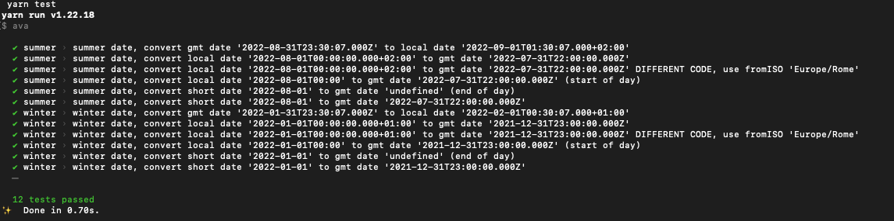

## Convert Date from GMT (ISO 8601) to local (Europe/Rome) and viceversa.

This projects contains a battery of tests written using [ava](https://github.com/avajs/ava) test framework.

Tests are use cases that shows how to convert a date in 'GMT/[ISO8601](https://en.wikipedia.org/wiki/ISO_8601)' format (the same format used in [mongodb date](https://www.mongodb.com/docs/manual/reference/method/Date/)) to a local date (Europe/Rome) and viceversa.

For example GMT to European/Rome date

-   `2022-08-01T15:00:00.000Z` is converted to `2022-08-01T17:00:00.000+02:00`

For example European/Rome date to GMT

-   `2022-08-01T00:00` is converted to `2022-07-31T22:00:00.000Z`
-   `2022-08-01` is converted to `2022-07-31T22:00:00.000Z`

Uses cases are written using [luxon 2.x](https://moment.github.io/luxon/#/).

### Built With

-   [Luxon](https://moment.github.io/luxon/#/)
-   [Ava](https://github.com/avajs/ava)
-   [Yarn](https://yarnpkg.com/)
-   [Volta](https://volta.sh/)

<p align="right">(<a href="#top">back to top</a>)</p>

## Getting Started

### Prerequisites

Be sure to have [node.js](https://nodejs.org/) v12.x or upper until v18.x and [yarn](https://yarnpkg.com/) installed. (preferably use [volta](https://volta.sh/))

### Installation

    ```sh
    yarn install
    ```

## Usage

    ```sh
    yarn test
    ```

It should return return something like this:



<!-- LICENSE -->

## License

Distributed under the MIT License. See `LICENSE.txt` for more information.

<p align="right">(<a href="#top">back to top</a>)</p>

<!-- CONTACT -->

## Contact

Marco Verdecchia - marco.verdecchia@gmail.com

Project Link: [https://github.com/verdecchia/converter-date-gmt-to-rome](https://github.com/verdecchia/converter-date-gmt-to-rome)
